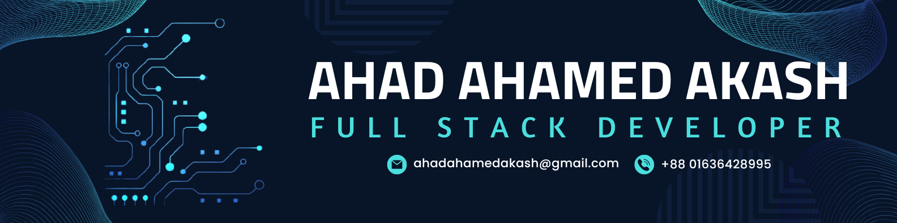

<h1 align="left">👋 Hi, I am Ahad Ahamed Akash</h1>

###

I'm a **Full Stack Developer** dedicated to building modern, scalable web applications primarily with **React.js**, **Next.js**, **JavaScript** **TypeScript**, and **Tailwind CSS**.

**My focus?** Delivering high-performance, clean-architecture solutions that are responsive & accessible. I've successfully built full-stack applications using the **MERN stack**, and I integrate modern UI libraries like **ShadCN UI** and **MUI** to build interactive interfaces. Need smooth interactions? I use **Framer Motion** & **GSAP** for captivating animations.

###

## 🌐 Socials:
      

## 💻 Tech Stack:
###

  
  
  
  
  
  
  
  
  
  
  
  
  
  
  
  
  
  
  
  
  
  
  
  
  
  
  
  
  
  
  
  
  
  
  
  
  
  
  

## 📊 GitHub Stats:

  

  

## 📊 CP Stats:

  

  

  

<!-- ## 🏆 GitHub Trophies
-->

###
